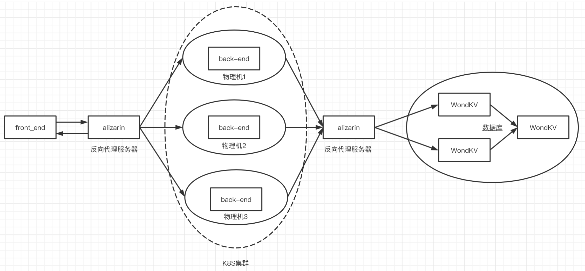

## 比赛截止日期

ddl：7月8日

## 要交的东西

- [ ] 设计说明文档
- [ ] 测试报告、测试数据、测试操作说明、测试过程与结果
- [ ] 演示视频（7分钟之内）
- [ ] PPT
- [ ] 源代码
- [ ] 程序包
- [ ] Web服务启动指令

2、作品实例应直接部署在公有云（或可以支持从Internet访问的私有云）平台上，方便评审老师访问。

## 系统架构

## Plan

### yrj

**6月30日之前** 7天

- [ ] 完成WondKV（数据库）以及相关测试报告
- [ ] 完成alizarin（反向代理服务器）以及相关测试报告
- [ ] 争取可以弄清楚K8S部署

**7月2日之前** 

- [ ] 完成WondKV设计报告
- [ ] 完成alizarin设计报告

**7月4日之前**

- [ ] 部署K8S

### nkj & xjh

**6月30日之前** 7天

- [x] 完成大概的back-end的设计说明文档
- [x] 完成现有设计下的back-end的开发
- [x] 实现多线程
- [ ] 弄懂非功能性需求在报告中的展现方式

### lz

**6月28日之前** 5天

- [ ] 完成前端

**7.6** 
nkj
- [ ] 加上剪枝
- [ ] 数据共享
- [ ] 写开发文档：java后端架构、部署

xjh
- [ ] 把第一套算法跑起来
- [ ] 写完算法部分的文档和PPT、系统设计

yrj
- [ ] 写开发文档
- [ ] 部署环境
- [ ] 测试

lz
- [ ] 写完前端
- [ ] 爬数据
- [ ] 写js脚本

