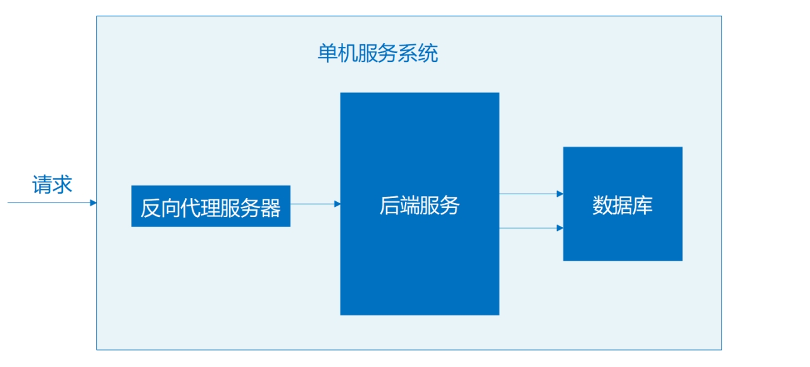
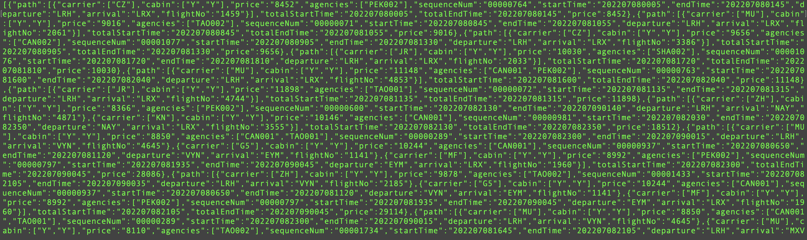

## Web服务启动指令



在这里将会说明单机服务系统的部署流程。单机服务系统可以达到最低的时间延迟。

服务完整运行需要在Linux环境，运行终端，进入code文件夹目录中。

> 如果不需要启动反向代理服务器Alizarin，可以使用安装有Rust、Java环境的其他系统运行Web服务

### 启动数据库服务

1. 进入WondKV目录下。
2. 确认Rust环境已安装。

```shell
$ cargo --version
```

3. 编译数据库可执行文件。

```shell
$ cargo build --release
```

4. 以默认配置直接运行数据库。

```shell
$ ./target/release/WondKV
```

WondKV运行时监听的默认端口是8080。由于代码中事先准备了数据文件，所以此时的数据库读取数据文件已经有了一定的航班信息数据。

### 启动后端服务

1. 进入FlightRecommendation目录下。
2. 确认Java环境已经安装。

```shell
$ java --version
```

3. 清理之前的文件。

```shell
$ mvn clean
```

4. 打包jar包。

```shell
$ mvn package
```

5. 然后进入项目的target目录下.

```shell
$ cd target
```

6. 最后运行jar包。

```shell
$ java -jar jar包名称
```

后端服务的默认配置是监听8333端口，并尝试访问本机监听在8080端口的WondKV数据库。

### 启动反向代理服务器服务

1. 进入alizarin目录下。

2. 编译反向代理服务器可执行文件。

```shell
$ make server
```

3. 运行反向代理服务器。

```shell
./server
```

反向代理服务器的默认配置同样也可以满足本机使用需求，监听8000端口，并将消息转发至后端服务的8333端口。

### 运行测试

使用curl命令访问服务进行测试。

```shell
$ curl -d "times=20220708&departures=LRH&arrival=LRX&passengerNum=2" "http://127.0.0.1:8000/recommend/second"
```

应该会返回如下结果：



### 说明

默认的代码参数设置使得我们可以直接在一台机器上运行Web服务，如果需要更复杂以及自定义的运行配置，可以参考设计说明文档每一部分的使用说明。
